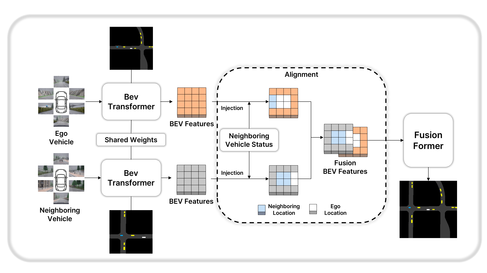

# FusionFormer

[English](README.md)

**상태: 기초 스터디 및 연구 구상 단계에서 중단.** 논문 작성을 목표로 기초 개념 학습과 관련 논문 스터디, 구조 스케치를 중심으로 진행했습니다. 실제 연구·프로젝트 개발은 제한적으로 이루어졌으며, 다른 프로젝트 병행에 따른 시간 제약과 컴퓨팅 자원·인력 부족으로 본격적인 모델 개발과 실험 검증까지 진행하지 못했습니다. 이 저장소에는 당시의 연구 구상과 구조 스케치를 정리했습니다.

자차에서 보이지 않는 영역을 이웃 차량의 BEV 특징으로 보완하는 FusionFormer를 구상했습니다. 차량마다 BEV 특징을 만든 뒤 위치 정보를 이용해 자차 좌표계로 정렬하고, transformer로 융합하는 구조입니다.

## 구상한 흐름

| 단계 | 내용 |
| --- | --- |
| 차량별 인지 | 자차와 이웃 차량의 카메라 관측에서 BEV 특징 생성. 스케치에는 BEV encoder의 가중치 공유가 표시되어 있습니다. |
| 차량 정보 주입 | 이웃 차량 상태와 각 차량의 위치 정보를 특징에 반영 |
| 정렬 | 이웃 차량의 특징을 자차 좌표계에 맞춤 |
| FusionFormer | 정렬된 특징과 자차 특징을 융합 |
| 활용 | 가려지거나 관측되지 않는 영역의 인지 보완. 구체적인 출력 head는 미정 |

## 남아 있는 연구 과제

- 실제로 시야가 보완되는 영역에서의 인지 성능
- 위치 오차, 시각 불일치, 통신 지연에 대한 민감도
- 전송할 공간 영역과 채널을 선택하는 방법
- 오래되거나 신뢰도가 낮은 이웃 정보의 처리

정확도·지연시간·통신량 개선 수치는 측정되지 않았습니다. 구현을 재개하면 동일 장면에서 자차 단독, 정렬 후 단순 융합, transformer 융합을 비교하는 것이 필요합니다.
